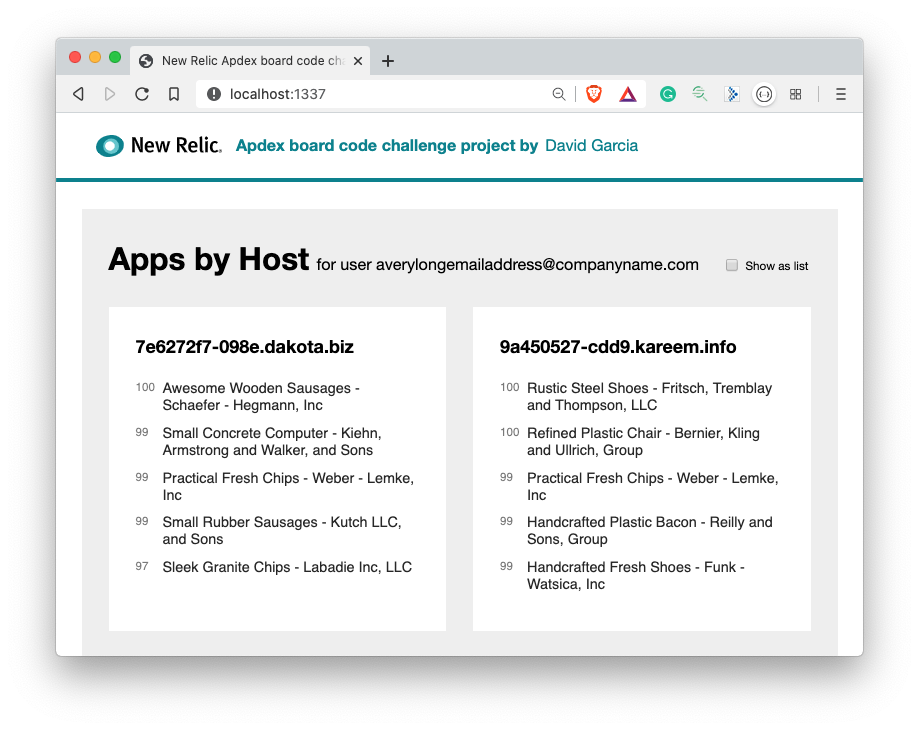

# New Relic Apdex Board code challenge

**A project build with vanilla JavaScript and ReactJS by [David García](https://www.linkedin.com/in/davidgarciaontivero/).**



## Getting Started

To get the project up and running you'll need a Linux, Windows or MacOSX computer with a bash/zshell terminal, Node JS and NPM installed.

### Prerequisites

Please, make sure you have:

- Node JS v.10 or higher
- NPM v.6 or higher

### Installing

- Drop the uncompressed folder into a terminal. Execute:

```bash
npm i
```

- After succesfully installed all dependencies. Run:

```bash
npm start
```

**The project will be available at [http://localhost:1337](http://localhost:1337/)**

## Running the tests

Launch test manually by running:

```bash
npm run test
```

### Testing main functionality

The `getTopAppsByHostUseCaseSpec` test implements the use case to perform the raw data fetching, transforms the response into a list of apps by host and the response is deeply compared with the expected result stored in a fixture file.

```js
describe('Given a JSON file to getTopAppsByHost useCase', () => {
  it('should return a list of Apps by Hosts sorted by Apdex', async () => {
    const useCaseResponse = await domain
      .get('get_top_apps_by_host')
      .execute()
      .then(useCaseResponse => useCaseResponse)

    expect(JSON.stringify(useCaseResponse)).to.be.deep.equal(
      JSON.stringify(getTopAppsByHostUseCaseResponse)
    )
  })
})
```

## Hexagonal architecture implementation

This project has been developed using an Hexagonal Architecture approach of a Clean Architecture. It has many advantages like:

- Separation of business logic from presentation.
- Good control of scalability and maintainability.
- Factory pattern allows domain object instantiation and dependency injection in a centralized place.
- Single responsibility principle: Using repositories to fetch data, mappers to perform transformation, etc...

## Big O notation

The sorting algorithm used in the application is the built in **Array.prototype.sort**.

## Deployment

Although this work is not deployed anywhere due to its privacy requirements, you can run `npm run build` to generate the static files ready for deploy.

## Built With

- [ReactJS](https://reactjs.org/) - To build the UI components
- [BabelJS](https://babeljs.io/) - Transpiler to ES6
- [Webpack](https://webpack.js.org/) - JS Bundler
- [Jest](https://jestjs.io/) - A delightful JS testing framework

## Author

- **David Garcia** - *Check out my work in Github* - [Davecarter](https://github.com/davecarter)

## License

This project is licensed under the MIT License - see the [LICENSE.md](LICENSE.md) file for details
